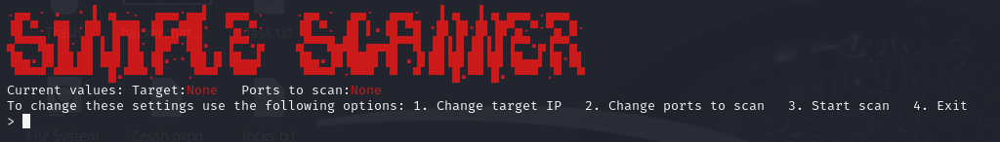

# Indice
WIP :)

* * *

# Escáner de puertos sencillo
[Link al repositorio de github.](https://github.com/Minispeedyt/simplescanner/tree/main)

1/31/2025
Me propuse crear un escáner de puertos sencillo usando python, para ello opté por usar scapy. La primera versión/prototipo funciona bien pero hay que modificar el código si quieres cambiar los puertos o la IP a escanear. Aquí está la primera versión del escáner:
```
from scapy.all import *
res,unans = sr(IP(dst="172.18.0.2")/TCP(flags="S", dport=(1,100)), timeout=1 )
for s,r in res:
    if r[TCP].flags == 0x12:
        print("Port %d is open" % s[TCP].dport)
    elif r[TCP].flags == 0x14:
        print("Port %d is closed" % s[TCP].dport)
    else:
        print("Port %d is closed or filtered.")
```
Vamos a analizarlo paso a paso para ver lo que hice y cómo funciona:

## ¿Qué es un escáner de puertos?
Un escáner de puertos es una herramienta utilizada para encontrar grietas en las defensas de un sistema. Imaginemos que un servidor es en realidad un castillo con muchas puertas. Algunas puertas están abiertas, dando la bienvenida a los viajeros (o intrusos). Otras están cerradas, impidiendo la entrada. Y algunas puertas están selladas, custodiadas por centinelas que no permiten entrar a nadie. 

### ¿Por qué es útil?
Un escáner de puertos ayuda a:
* A los hackers éticos y profesionales en ciberseguridad a encontrar puntos débiles antes de que lo hagan los atacantes.
* A los administradores de sistemas a asegurarse de que sólo están abiertos los puertos que son necesarios, reduciendo los riesgos de seguridad.

## ¿Cómo funciona?
El escáner envía paquetes de red especiales a diferentes puertos de una máquina objetivo.
A continuación, escucha las respuestas y clasifica los puertos como:
1.    Abierto → El servicio responde, lo que significa que el puerto está en uso.
2.    Cerrado → El objetivo rechaza la petición, indicando que el puerto no está activo.
3.    Filtrado → No responde en absoluto, posiblemente bloqueado por un cortafuegos.

### ¿Qué es un paquete?
Un paquete es la unidad más pequeña de datos que viaja a través de una red. Es un fragmento minúsculo de un mensaje, que transporta información de un ordenador a otro.
Cada paquete consta de tres partes

- Encabezado = Lleva instrucciones esenciales:
  - IP de origen (de dónde procede)
  - IP de destino (a dónde debe ir)
  - Información de Protocolo (¿Es TCP? ¿UDP? ¿ICMP?)
  - Número de paquete (Cómo encaja en el mensaje completo)
- Carga útil = Los datos reales, ya sea un fragmento de un correo electrónico, un trozo de un vídeo o parte de una página web.
- Remolque (opcional) = A veces, se añade una suma de comprobación o datos de comprobación de errores para verificar que el paquete no se ha corrompido en tránsito.

### ¿Cómo se establece una conexión entre ordenadores?
Normalmente, una conexión se establece utilizando lo que se conoce como un handshake de tres direcciones, que tiene el siguiente aspecto:
1.    SYN → El dispositivo del usuario llama a la puerta del servidor, enviando un paquete SYN (sincronizar) para solicitar una conexión.
2.    SYN-ACK → El servidor responde a la llamada con SYN-ACK (sincronización-aceptación), indicando que está preparado.
3.    ACK → El dispositivo del usuario confirma enviando un paquete ACK (acknowledge/aceptación), completando el handshake, y permitiendo el flujo de datos.

Si un puerto está cerrado, el handshake se vería así:

1.    SYN → El cliente llama a la puerta del servidor, enviando un paquete SYN (sincronizar) para solicitar una conexión.
2.    RST-ACK → En lugar de dar la bienvenida a la solicitud, el servidor cierra la puerta de golpe, respondiendo con RST-ACK (reset-acknowledge), rechazando forzosamente la conexión. Después de esto, no se produce ninguna otra comunicación.

Utilizando esta información, podemos saber si los puertos de un servidor o de un dispositivo están abiertos o cerrados.

## Enviar paquetes
Primero, importamos scapy y usamos `sr(IP(dst="172.18.0.2")/TCP(flags="S", dport=(1,100)), timeout=1 )` para enviar los paquetes, donde `IP(dst="172.18.0.2")` le dice a scapy a qué IP enviar los paquetes, `TCP(flags="S"` especifica que queremos enviar paquetes SYN (esos son los paquetes usados en el primer paso de un handshake TCP), `dport=(1,100))` significa que queremos escanear todos los puertos entre 1 y 100 y por último `timeout=1` le dice a scapy cuánto tiempo debe esperar por una respuesta. Almacenamos los paquetes que han recibido respuesta en 'res' (pares enviados y recibidos) y los paquetes que no han recibido respuesta en 'unans'.

## Encontrando puertos abiertos o cerrados
Creamos un bucle for donde miramos cada paquete enviado y recibido (`for s,r in res:`), entonces por cada paquete recibido comprobamos si la flag de respuesta del paquete es SYN-ACK (0x12) o RST-ACK (0x14). Esto funciona porque 0x12 convertido a binario y luego mapeado a las posiciones del flag de la respuesta se vería así: 
*    NS = 0
*    CWR = 0
*    ECE = 0
*    URG = 0
*    ACK = 1
*    PSH = 0
*    RST = 0
*    SYN = 1
*    FIN = 0

Si haces lo mismo con 0x14, verás que obtendrás RST-ACK. Como se mencionó anteriormente, SYN-ACK significaría que el puerto está abierto y RST-ACK significaría que está cerrado.
Por cada paquete enviado vamos a usar `s[TCP].dport` a la hora de decirle al usuario que número de puerto está abierto y cerrado.
Eso es todo por hoy, mañana haré que sea más fácil cambiar los puertos y la IP a escanear y añadiré otras mejoras para que sea mas facil de usar.

* * *

1/2/2025

Para el segundo día de este proyecto, he añadido un montón de cambios para que sea más fácil de usar, vamos a echar un vistazo.

## Ctrl+C para salir

Este es uno de los cambios que más me gustan, la capacidad de detener el escáner usando ctrl+c. Normalmente, cuando pulsas ctrl+c, el escáner puede tardar un rato en detenerse y mostrar un mensaje de "Keyboard interrupt", así que he añadido algunas líneas de código que capturan esa entrada de ctrl+c y detienen instantáneamente el escáner, también muestra un mensaje de "Stopping the scanner..." porque creo que es mejor que "Keyboard interrupt", aquí está el extracto de código:

```
import signal
import sys
def signal_handler(sig, frame):
    print('Stopping the scanner...')
    sys.exit(0)
signal.signal(signal.SIGINT, signal_handler)
```

## Control por parte del usuario

En lugar de tener que editar el código para cambiar la IP de destino y cosas por el estilo, he añadido una función para elegir el tipo de escaneo y una pregunta para establecer la IP de destino, también se muestra algunos ejemplos de entrada válida. Después de que el usuario elige una IP de destino, si se trata de una lista de IPs se desinfecta la entrada para que se convierta en una lista sin espacios en blanco y si se trata de otro tipo de entrada como una sola IP, entonces simplemente se sigue ejecutando normalmente. Cuando eliges el tipo de escaneo si eliges un número que no está en la lista de opciones o si escribes cosas como 'Opción 1' o 'Uno' en lugar de '1' entonces te dice que escribas el número de la opción que quieres usar.

```
print("Please write the target IP to scan, this can be a single IP, an IP range, a list of IPs or even a hostname.")
print("Examples: \nSingle IP = 192.168.0.1      IP list: 192.168.0.1, 172.18.0.1, 10.0.0.8\nIP range: 192.168.0.1/24     Hostname: example.com\n")
targetraw = input("> ")
print()
if ',' in targetraw:
    target = targetraw.split(',')
    target = [i.strip(' ') for i in target]
else:
    target = targetraw

def changescan():
    print("What kind of scan do you want to perform?\n1. ICMP Ping  2. TCP SYN\n")
    scantype = input("> ")
    match scantype:
        case "1":
            ping(target)
        case "2":
            scan(target)
        case _:
            print("\nPlease write only the number")
            changescan()
```

## Ping ICMP
He añadido la opción de comprobar si un host está activo o no realizando un ping ICMP.

```
def ping(target):
    #Check if the target machine is online using an ICMP ping.
    res, unans = sr(IP(dst=target)/ICMP(), timeout=3, verbose=0)
    live_ips = {received.src for sent, received in res}
    print("\nScan Results:")
    for ip in live_ips:
            print(f"{ip} is up")
```

## Arreglos menores

En este bucle for que usé en la versión anterior del escáner, la última sentencia else no tenía que estar ahí, tenía que estar fuera del bucle for porque no éramos capaces de ver los puertos filtrados si intentábamos encontrar paquetes que no fueran SYN-ACK o RST-ACK, en realidad teniamos que comprobar los paquetes que no recibían ninguna respuesta. Así es como se veía antes:

```
for s,r in res:
    if r[TCP].flags == 0x12:
        print("Port %d is open" % s[TCP].dport)
    elif r[TCP].flags == 0x14:
        print("Port %d is closed" % s[TCP].dport)
    else:
        print("Port %d is closed or filtered.")
```

Asi es como se ve ahora:

```
for s,r in res:
    if r[TCP].flags == 0x12:
        print(f"Port {s[TCP].dport} in {s[IP].dst} is open")
    elif r[TCP].flags == 0x14:
        print(f"Port {s[TCP].dport} in {s[IP].dst} is closed")
for s in unans:
    print(f"Port {s[TCP].dport} in {s[IP].dst} is closed or filtered.")
```

Como pueden ver, agregué otro bucle for, este sí puede imprimir qué puertos están filtrados, fue un arreglo muy fácil.
Puede que ya te hayas dado cuenta de que he cambiado otra cosa, ahora siempre que veamos qué puertos están abiertos/cerrados/filtrados, ¡también podemos echar un vistazo a la IP que tiene esos puertos en ese estado! Esto es útil cuando escaneamos múltiples IPs.

* * *

2/2/2025

El código se está haciendo un poco largo para mostrarlo aquí, así que siéntete libre de visitar el repositorio de github y verlo por ti mismo, seguiré proporcionando un resumen de los cambios añadidos al escáner y lo que hacen o cómo funcionan.

## Cambios estéticos

La mayoría de los cambios que hice hoy son sólo estéticos pero fueron bastante divertidos de implementar. Primero usé este [sitio web](https://patorjk.com/software/taag/#p=display&f=Graffiti&t=Type%20Something%20) para generar el arte ascii para el escáner. También lo hice para que sea más fácil navegar a través de las opciones, cuando abres el escáner verás la IP objetivo actual y los puertos, puedes cambiar la IP objetivo actual y los puertos usando las opciones que el escáner provee, también puedes iniciar el escaneo o salir. Ahora cuando lo abrimos nos muestra este mensaje:



Eso es más o menos todo lo que he hecho hoy, no es mucho pero hace que el escáner sea más fácil de usar y se sienta más interactivo.
