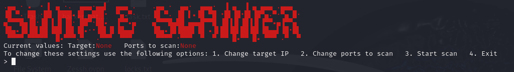

[](./es.html)

[Click here to change to spanish!](./es.html)
# Index
WIP :)
# Simple port scanner
[Link to the github repo.](https://github.com/Minispeedyt/simplescanner/tree/main)

1/31/2025

I wanted to create a simple port scanner using python, for this I decided that I was going to use scapy. The first version/prototype works well but you have to modify the code if you want to change the ports or the IP to scan. Here's the first version of the scanner:
```
from scapy.all import *
res,unans = sr(IP(dst="172.18.0.2")/TCP(flags="S", dport=(1,100)), timeout=1 )
for s,r in res:
    if r[TCP].flags == 0x12:
        print("Port %d is open" % s[TCP].dport)
    elif r[TCP].flags == 0x14:
        print("Port %d is closed" % s[TCP].dport)
    else:
        print("Port %d is closed or filtered.")
```
Let's break it down step by step to see what I did and how it works:
## What is a port scanner?
A port scanner is a tool used to find openings in a system's defenses. Let's imagine that a server is actually a castle with many doors. Some gates are open, welcoming travelers (or intruders). Others are locked, denying entry. And some gates are sealed shut, guarded by sentinels that don't allow anyone to enter. 
### Why is it useful?
A port scanner helps:
*    Ethical hackers and cybersecurity professionals to find weak points before attackers do.
*    System administrators to ensure only necessary ports are open, reducing security risks.

## How does it work?
It sends special network packets to different ports on a target machine.
It listens for responses, classifying ports as:
1.    Open → The service responds, meaning the port is in use.
2.    Closed → The target rejects the request, indicating the port isn’t active.
3.    Filtered → No response at all—possibly blocked by a firewall.

### What is a packet?
A packet is the smallest unit of data that travels across a network. It is a tiny fragment of a message, carrying information from one computer to another.
Each packet consists of three parts:
- Header = It carries essential instructions:
  - Source IP (Where it came from)
  - Destination IP (Where it should go)
  - Protocol Information (Is it TCP? UDP? ICMP?)
  - Packet Number (How it fits into the full message)
- Payload = The actual data, whether it be a piece of an email, a chunk of a video, or part of a webpage.
- Trailer (optional) = Sometimes, a checksum or error-checking data is added to verify the packet wasn’t corrupted in transit.

### How is a connection established between computers?
Usually a connection is established using what is known as a three way handshake, it looks like this:
1.    SYN → The user's device knocks on the server’s door, sending a SYN (synchronize) packet to request a connection.
2.    SYN-ACK → The server answers the knock, replying with SYN-ACK (synchronize-acknowledge), signaling it is ready.
3.    ACK → The user's device confirms by sending an ACK (acknowledge) packet, completing the handshake, and allowing data to flow.

If a port is closed, the handshake would instead look like this:

1.    SYN → The client knocks on the server’s door, sending a SYN (synchronize) packet to request a connection.
2.    RST-ACK → Instead of welcoming the request, the server slams the door shut, responding with RST-ACK (reset-acknowledge), forcefully rejecting the connection. After this, no further communication occurs.

Using this information, we can know whether the ports of a server or a device are open or closed.

## Sending packets
First, we import scapy and we use `sr(IP(dst="172.18.0.2")/TCP(flags="S", dport=(1,100)), timeout=1 )` to send the packets, where `IP(dst="172.18.0.2")` tells scapy which IP to send the packets to, `TCP(flags="S"` specifies that we want to send SYN packets (those are the packets used in the first step of a TCP handshake), `dport=(1,100)` means that we want to scan all the ports between 1 and 100 and lastly `timeout=1` tells scapy how much time to wait for a response. We store the answered packets in 'res' (sent and received pairs) and the packets that received no response in 'unans'.
## Finding open/closed ports
We create a for loop where we look at each sent and received packet (`for s,r in res:`), then for every received packet we check whether the response flag of it is SYN-ACK (0x12) or RST-ACK (0x14). This works because 0x12 converted to binary and then mapped to the flag positions of the response would look like this: 
*    NS = 0
*    CWR = 0
*    ECE = 0
*    URG = 0
*    ACK = 1
*    PSH = 0
*    RST = 0
*    SYN = 1
*    FIN = 0

If you do the same with 0x14, you'll see that you'll get RST-ACK. As mentioned before, SYN-ACK would mean that the port is open and RST-ACK would mean that it's closed.
For every sent packet we're going to use `s[TCP].dport` in a print statement so that we can tell the user the number of each open and closed port.
That's it for today, tomorrow I'll make it so that it's easier to change the ports and IP to scan and I'll add other QoL changes.

1/2/2025

For the second day of this project, I added a lot of changes so that it's easier to use, let's take a look.

## Ctrl+C to leave
This is one of the changes that I like the most, the ability to stop the scanner using ctrl+c. Usually, when you press ctrl+c, it might take a while for the scanner to stop and it'd display a "Keyboard interrupt" message, so I added some lines of code that capture that ctrl+c input and instantly stop the scanner, it also displays a "Stopping the scanner..." message because I think that's better than "Keyboard interrupt", here's the code snippet:

```
import signal
import sys
def signal_handler(sig, frame):
    print('Stopping the scanner...')
    sys.exit(0)
signal.signal(signal.SIGINT, signal_handler)
```

## User input
Instead of having to edit the code to change the target IP and things like that, I added a function to choose the scan type and a prompt to set the target IP, it also displays some examples of valid input. After the user picks a target IP, if it's a list of IPs it sanitizes the input so that it actually becomes a list without blank spaces and if it's other kinds of input like a single IP then it just continues working normally. When you choose the scan type if you choose a number that's not in the list of options or if you write things like 'Option 1' or 'One' instead of '1' then it tells you to just write the number of the option that you want to use.

```
print("Please write the target IP to scan, this can be a single IP, an IP range, a list of IPs or even a hostname.")
print("Examples: \nSingle IP = 192.168.0.1      IP list: 192.168.0.1, 172.18.0.1, 10.0.0.8\nIP range: 192.168.0.1/24     Hostname: example.com\n")
targetraw = input("> ")
print()
if ',' in targetraw:
    target = targetraw.split(',')
    target = [i.strip(' ') for i in target]
else:
    target = targetraw

def changescan():
    print("What kind of scan do you want to perform?\n1. ICMP Ping  2. TCP SYN\n")
    scantype = input("> ")
    match scantype:
        case "1":
            ping(target)
        case "2":
            scan(target)
        case _:
            print("\nPlease write only the number")
            changescan()
```

## ICMP Ping
I added the option to check whether a host is up or not by performing an ICMP ping.

```
def ping(target):
    #Check if the target machine is online using an ICMP ping.
    res, unans = sr(IP(dst=target)/ICMP(), timeout=3, verbose=0)
    live_ips = {received.src for sent, received in res}
    print("\nScan Results:")
    for ip in live_ips:
            print(f"{ip} is up")
```

## Minor fixes
In this for loop that I used in the previous version of the scanner, the last else statement didn't have to be there, it had to be outside of the for loop because we wouldn't be able to see filtered ports if we tried to find packets that weren't SYN-ACK or RST-ACK, we actually wanted to check the packets that didn't receive any response at all. This is what it looked like before:

```
for s,r in res:
    if r[TCP].flags == 0x12:
        print("Port %d is open" % s[TCP].dport)
    elif r[TCP].flags == 0x14:
        print("Port %d is closed" % s[TCP].dport)
    else:
        print("Port %d is closed or filtered.")
```

This is what it looks like now:

```
for s,r in res:
    if r[TCP].flags == 0x12:
        print(f"Port {s[TCP].dport} in {s[IP].dst} is open")
    elif r[TCP].flags == 0x14:
        print(f"Port {s[TCP].dport} in {s[IP].dst} is closed")
for s in unans:
    print(f"Port {s[TCP].dport} in {s[IP].dst} is closed or filtered.")
```

As you can see, I added another for loop, this one can actually print which ports are filtered, it was a very easy fix.
You might've already noticed that I changed another thing, now whenever we see which ports are open/closed/filtered, we can also take a look at the IP that has those ports in that state! This is useful when scanning multiple IPs.

* * *

2/2/2025

The code is getting kinda long to display it here, so feel free to visit the github repo and see it for yourself, I'll continue providing a summary of the changes added to the scanner and what they do or how they work.

## Aesthetic changes

Most of the changes that I made today are only aesthetic but they were pretty fun to implement. First I used [this website](https://patorjk.com/software/taag/#p=display&f=Graffiti&t=Type%20Something%20) to generate some ascii art for the scanner. I also made it so that it's easier to navigate through the options, when you open the scanner you'll see the current target IP and ports, you can change the current target IP and ports by using the options that the scanner provides, you can also start the scan or exit. Now when we open it, it displays this message:



That's pretty much everything that I did today, it isn't much but is makes the scanner easier to use and it feels more interactive.
